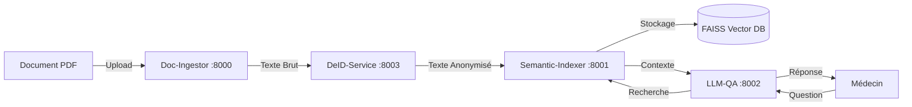

# 🏥 DocQA-MS - Assistant Médical Intelligent 


**DocQA-MS** est une solution d'intelligence artificielle permettant d'interroger des dossiers médicaux (PDF) en langage naturel. Le projet se distingue par une **architecture microservices** et un module d'**anonymisation (De-Identification)** qui protège les données patients avant l'indexation.

---

##  Architecture du Projet

Le système est composé de 5 microservices interconnectés :



###  Détail des Microservices

| Service | Port | Description |
|---------|------|-------------|
| **Doc-Ingestor** | 8000 | Reçoit les PDF, extrait le texte brut et l'envoie au service de sécurité. |
| **DeID-Service** | 8003 | **Sécurité**. Identifie et masque les données sensibles (Noms, Tels) avant traitement IA. |
| **Semantic-Indexer** | 8001 | Convertit le texte anonymisé en vecteurs (Embeddings) et les stocke. |
| **LLM-QA** | 8002 | Le "Cerveau". Interroge la base vectorielle et génère la réponse via Mistral-7B. |
| **Frontend** | 3000 | Interface utilisateur (Next.js) pour l'upload et le Chat médical. |

---

##  Installation et Démarrage (Windows)

Ce projet inclut des scripts d'automatisation (`.bat`) pour simplifier l'installation et le lancement.

### 1. Pré-requis

- **Python 3.9+** (Ajouté au PATH)
- **Node.js** (Version LTS recommandée)
- Un compte **HuggingFace** (pour obtenir un Token d'accès gratuit)

### 2. Installation Automatisée

Nous avons créé un script qui installe tout pour vous (Python & Node.js).

1. **Double-cliquez** sur le fichier `dependence.bat`
2. Ce script :
   - Met à jour `pip`
   - Installe toutes les librairies Python (FastAPI, LangChain, Spacy...)
   - Télécharge le modèle de langue français
   - Installe les modules du Frontend

### 3. Configuration de l'IA (Obligatoire)

Avant de lancer, vous devez configurer l'accès au modèle Mistral.

1. Allez dans le dossier `llm-qa-module`
2. Créez un fichier nommé `.env`
3. Ajoutez votre token HuggingFace à l'intérieur :

```bash
HF_TOKEN=votre_token_huggingface_ici
```

### 4. Lancement du Système

Plus besoin d'ouvrir 5 terminaux manuellement !

1. **Double-cliquez** sur `runall.bat`
2. Le script va ouvrir automatiquement :
   - Les 4 microservices Python dans des fenêtres séparées
   - Le serveur Frontend Next.js
3. Attendez quelques secondes que tout démarre
4. Ouvrez votre navigateur sur : **http://localhost:3000**

---

##  Focus Technique & Sécurité

###  Pipeline d'Anonymisation (De-ID)

Le système respecte le principe de **Privacy by Design**. Le LLM ne voit jamais les données brutes.

1. **Extraction** : Le texte est extrait du PDF via `pdfplumber`
2. **Masquage Regex** : Les emails et numéros de téléphone sont remplacés par des balises génériques
3. **NLP (Spacy)** : Les noms de patients et médecins sont détectés et remplacés par des pseudonymes (`Patient_1`, `Dr_X`)

###  Moteur IA (RAG)

- **Modèle** : `mistralai/Mistral-7B-Instruct-v0.2` (via HuggingFace API)
- **Embeddings** : `sentence-transformers/paraphrase-multilingual-MiniLM-L12-v2`
- **Stockage Vectoriel** : FAISS (Local) pour une recherche sémantique rapide

---

##  Structure du Projet

```
.
├── doc-ingestor/          # Service d'ingestion (Port 8000)
├── deid-service/          # Service d'anonymisation (Port 8003)
├── semantic-indexer/      # Service d'indexation vectorielle (Port 8001)
├── llm-qa-module/         # Service LLM & QA (Port 8002)
├── interface-nextjs/      # Frontend Next.js (Port 3000)
├── interface-streamlit/   # Interface alternative (Streamlit)
├── runall.bat            # Script de lancement automatique
└── dependence.bat        # Script d'installation des dépendances
```

---

##  Développement

### Lancer un service individuellement

```bash
# Doc-Ingestor
cd doc-ingestor
python -m uvicorn main:app --reload --port 8000

# DeID-Service
cd deid-service
python -m uvicorn main:app --reload --port 8003

# Semantic-Indexer
cd semantic-indexer
python -m uvicorn main:app --reload --port 8001

# LLM-QA
cd llm-qa-module
python -m uvicorn main:app --reload --port 8002

# Frontend
cd interface-nextjs
npm run dev
```

### API Documentation

Une fois les services lancés, accédez à la documentation Swagger :

- **Doc-Ingestor** : http://localhost:8000/docs
- **DeID-Service** : http://localhost:8003/docs
- **Semantic-Indexer** : http://localhost:8001/docs
- **LLM-QA** : http://localhost:8002/docs

---

##  Notes Importantes

- Les données anonymisées sont sauvegardées dans `deid-service/debug_anonymized_docs/` pour vérification
- La base vectorielle FAISS est stockée dans `semantic-indexer/vector_store/`
- Les PDFs uploadés sont stockés dans `doc-ingestor/documents/`

---

##  Technologies Utilisées

- **Backend** : FastAPI, Uvicorn
- **IA/ML** : LangChain, HuggingFace , Mistral-7B
- **NLP** : Spacy (fr_core_news_md)
- **Vector DB** : FAISS
- **Frontend** : Next.js, TypeScript, 
- **PDF Processing** : pdfplumber

---


